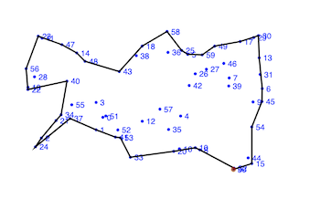

# Concave Hull JS



Calculate a Concave Hull from a set of points in 2D space.

Given a set of points, this code will calculate the points that define a concave polygon that
surrounds all of the points. These points will be selected, ordered in a continuous path and returned.

This code follows the algorithm defined by Adriano Moreira and Maribel Yasmina Santos in their paper
"[Concave Hull: A K-nearest Neighbours Approach For The Computation Of The Region Occupied By A Set Of Points](http://repositorium.sdum.uminho.pt/bitstream/1822/6429/1/ConcaveHull_ACM_MYS.pdf)".

Some parts of the algorithm have been adapted to more closely align with JavaScript. Comments are
added where the deviations occur.

Thank you to João Paulo Figueira for his article,
"[The Concave Hull](https://towardsdatascience.com/the-concave-hull-c649795c0f0f)", 
describing his Python implementation.

In an effort to create an all-in-one library, I have used code available in public forums
from other developers. Links are provided where this code appears and I have made an effort to
isolate these functions and modify them as little as possible.

## Example

Input:

```
let points = [
  [-0.2, -0.8],
  [ 0.1, -0.8],
  [ 0.5, -0.7],
  [ 0.6, -0.6],
  [-0.5, -0.5],
  [ 0.3, -0.4],
  [-0.6, -0.2],
  [-0.35, -0.18],
  [0.05, -0.2],
  [-0.1, 0.1],
  [-0.6, 0.2],
  [0.05, 0.4],
  [-0.5, 0.5],
  [ 0.5, 0.55],
  [-0.1, 0.7],
  [ 0.2, 0.8]
];
```

Output with a "k" value of 3: 

```
[
    [ 0.2, 0.8],
    [ 0.5, 0.55],
    [-0.1, 0.1],
    [0.05, -0.2],
    [ 0.3, -0.4],
    [ 0.6, -0.6],
    [ 0.5, -0.7],
    [ 0.1, -0.8],
    [-0.2, -0.8],
    [-0.5, -0.5],
    [-0.6, -0.2],
    [-0.6, 0.2],
    [-0.5, 0.5],
    [-0.1, 0.7],
    [ 0.2, 0.8]
]
```

## Browser Usage

Include the script in the HTML:

```
<script src="concaveHull.min.js"></script>
```

Call the `calculate` function on a set of points:

```
// Create random points
let points = new Array();
for (let i = 0; i < 60; i++) {
  points.push([Math.random(), Math.random()])
}

// Define your k value
const k = 3;

// Call the calculate() function
let hull = concaveHull.calculate(points, k);
```

## Command Line Usage

NOTE: This is my first NPM package so I'm not sure if all of this is correct!

```
npm install @markroland/concave-hull
```

```
node index.js [input filepath] 
```

```

## Node Project Usage

```
const ch = require('./src/concaveHull.js')

let points = [
  [-0.2, -0.8],
  [ 0.1, -0.8],
  [ 0.5, -0.7],
  [ 0.6, -0.6],
  [-0.5, -0.5],
  [ 0.3, -0.4],
  [-0.6, -0.2],
  [-0.35, -0.18],
  [0.05, -0.2],
  [-0.1, 0.1],
  [-0.6, 0.2],
  [0.05, 0.4],
  [-0.5, 0.5],
  [ 0.5, 0.55],
  [-0.1, 0.7],
  [ 0.2, 0.8]
];

let calculated_hull = ch.concaveHull.calculate(points, 3)

console.log(calculated_hull)
```

## License

<a rel="license" href="http://creativecommons.org/licenses/by-sa/4.0/"></a><br />This work is licensed under a <a rel="license" href="http://creativecommons.org/licenses/by-sa/4.0/">Creative Commons Attribution-ShareAlike 4.0 International License</a>.
