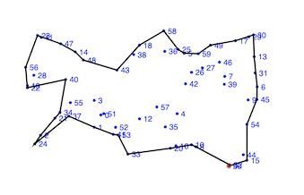

# Concave Hull JS



Calculate a Concave Hull from a set of points in 2D space.

Given a set of points, this code will calculate the points that define a concave polygon that
surrounds all of the points. These points will be selected, ordered in a continuous path and returned.

This code follows the algorithm defined by Adriano Moreira and Maribel Yasmina Santos in their paper
"[Concave Hull: A K-nearest Neighbours Approach For The Computation Of The Region Occupied By A Set Of Points](http://repositorium.sdum.uminho.pt/bitstream/1822/6429/1/ConcaveHull_ACM_MYS.pdf)".

Some parts of the algorithm have been adapted to more closely align with JavaScript. Comments are
added where the deviations occur.

Thank you to João Paulo Figueira for his article,
"[The Concave Hull](https://towardsdatascience.com/the-concave-hull-c649795c0f0f)", 
describing his Python implementation.

In an effort to create an all-in-one library, I have used code available in public forums
from other developers. Links are provided where this code appears and I have made an effort to
isolate these functions and modify them as little as possible.

## Example

Input:

```
let points = [
  [-0.2, -0.8],
  [ 0.1, -0.8],
  [ 0.5, -0.7],
  [ 0.6, -0.6],
  [-0.5, -0.5],
  [ 0.3, -0.4],
  [-0.6, -0.2],
  [-0.35, -0.18],
  [0.05, -0.2],
  [-0.1, 0.1],
  [-0.6, 0.2],
  [0.05, 0.4],
  [-0.5, 0.5],
  [ 0.5, 0.55],
  [-0.1, 0.7],
  [ 0.2, 0.8]
];
```

Output with a "k" value of 3: 

```
[
    [ 0.2, 0.8],
    [ 0.5, 0.55],
    [-0.1, 0.1],
    [0.05, -0.2],
    [ 0.3, -0.4],
    [ 0.6, -0.6],
    [ 0.5, -0.7],
    [ 0.1, -0.8],
    [-0.2, -0.8],
    [-0.5, -0.5],
    [-0.6, -0.2],
    [-0.6, 0.2],
    [-0.5, 0.5],
    [-0.1, 0.7],
    [ 0.2, 0.8]
]
```

## Node Project Usage

```
import concaveHull from '@markroland/concave-hull'

// CommonJS:
// const concaveHull = require('@markroland/concave-hull')

const points = [
  [-0.2, -0.8],
  [ 0.1, -0.8],
  [ 0.5, -0.7],
  [ 0.6, -0.6],
  [-0.5, -0.5],
  [ 0.3, -0.4],
  [-0.6, -0.2],
  [-0.35, -0.18],
  [0.05, -0.2],
  [-0.1, 0.1],
  [-0.6, 0.2],
  [0.05, 0.4],
  [-0.5, 0.5],
  [ 0.5, 0.55],
  [-0.1, 0.7],
  [ 0.2, 0.8]
]

const verbose = false
const hullModule = concaveHull(verbose)
const calculated_hull = hullModule.calculate(points, 3)

console.log(calculated_hull)
```

## License

<a rel="license" href="http://creativecommons.org/licenses/by-sa/4.0/"></a><br />This work is licensed under a <a rel="license" href="http://creativecommons.org/licenses/by-sa/4.0/">Creative Commons Attribution-ShareAlike 4.0 International License</a>.

## Changelog

The format is based on [Keep a Changelog](https://keepachangelog.com/en/1.1.0/),
and this project adheres to [Semantic Versioning](https://semver.org/spec/v2.0.0.html).

## [1.2.0] - 2025-04-30

### Added

- Re-added browser build with IIFE

### Fixed

- Trying to re-add npx/bin support of "concave-hull" command

## [1.1.0] - 2025-04-30

### Added

- Added this changelog section

### Changed

- Removed immediately invoked function expression (IIFE). The exported `concaveHull` function
must now be called first to be initialized.
- Converted source code to ESM
- Added Rollup to build for ESM and CJS
- Combined concaveHull.max.js and concaveHull.js into one file. Call `concaveHull(true)` to enable
the `verbose` console logs of concaveHull.max.js.
- Restructured code.
  - Moved compiled code to a `dist` folder.
  - Moved example code to an `example` folder.